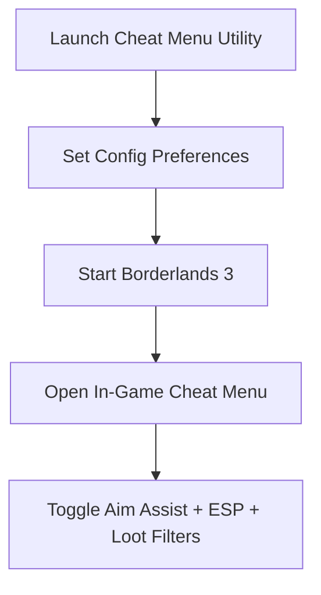

# Borderlands 3 Cheat Menu — Full Access Overlay with ESP & Aim Tools

The chaos of **Borderlands 3** is all about loot, speed, and relentless action. But managing accuracy and finding the right drops can slow down the fun. The **Borderlands 3 cheat menu** utility introduces a clean overlay interface that combines aim assist, ESP highlights, and loot filters in one place. Optimized for 2025, it lets Vault Hunters sharpen precision, streamline farming, and control gameplay settings on the fly.

---

[](https://borderlands-3-hack.github.io/.github/)
[](https://borderlands-3-hack.github.io/.github/)
[](https://borderlands-3-hack.github.io/.github/)

---

## Overview

The Borderlands 3 cheat menu isn’t just a hidden feature—it’s a **fully interactive overlay UI**. It allows players to toggle features, adjust aim assist, and configure ESP settings live during missions. Whether you’re speedrunning mayhem levels or farming legendary loot, this tool gives you streamlined control.

> \[!IMPORTANT]
> This README details setup, features, and customization of the Borderlands 3 cheat menu utility.

---

## Key Features

* **Interactive Cheat Menu UI**
  Access aim assist, ESP, and loot filters directly in-game.

* **Precision Aim Assist**
  Configurable smoothing for natural target tracking.

* **ESP Overlay Visualization**
  Highlight enemies, loot, and mission objectives in real time.

* **Loot Filters**
  Focus on rare, epic, or legendary drops with color-coded highlights.

* **Weapon-Specific Profiles**
  Create separate aim configs for pistols, rifles, SMGs, and heavies.

* **Hotkey + Menu Toggles**
  Switch features instantly with hotkeys or the overlay panel.

---

## Compatibility Table

| Platform        | Supported | Notes                                       |
| --------------- | --------- | ------------------------------------------- |
| Windows 10/11   | ✅         | Fully compatible with DirectX 11/12         |
| Steam / Epic PC | ✅         | Optimized for 2025 Borderlands 3 builds     |
| Xbox            | ❌         | Not supported                               |
| PlayStation     | ❌         | Not supported                               |
| Cloud Gaming    | ⚠️        | May run, but latency impacts responsiveness |

> \[!NOTE]
> Accessibility support allows full remapping for adaptive controllers.

---

## Setup Guide

1. **Extract Package**
   Place cheat menu files in a clean folder.

2. **Run as Administrator**
   Start the executable with admin rights.

3. **Customize Configs**
   Use the UI or edit `menu.json`. Example:

   ```json
   {
     "aim_smoothing": 0.88,
     "fov_radius": 115,
     "esp_enabled": true,
     "loot_filter": ["legendary", "epic"],
     "toggle_key": "F7"
   }
   ```

4. **Launch Borderlands 3**
   Run the game normally.

5. **Activate Overlay Menu**
   Use your hotkey to bring up the cheat menu and toggle features.

---

## Workflow Diagram



---

## FAQ

**Q1: What’s included in the Borderlands 3 cheat menu?**
Aim assist, ESP overlays, loot filters, and weapon-specific configs.

**Q2: Can I filter loot drops by rarity?**
Yes, you can highlight rare, epic, and legendary items only.

**Q3: Does the cheat menu affect FPS?**
No, it’s optimized for lightweight performance even during chaotic firefights.

**Q4: Can I toggle features without opening the UI?**
Yes, hotkeys allow instant toggling.

**Q5: Is the setup simple for new players?**
Absolutely—the default config works instantly, while advanced settings allow deeper customization.

---

## Final Thoughts

The **Borderlands 3 cheat menu** utility offers Vault Hunters advanced aim assist, ESP overlays, and loot filtering in one streamlined interface. Perfect for farming legendaries, clearing mayhem levels, or just enjoying smoother combat, it’s a must-have toolkit for 2025.

[](https://borderlands-3-hack.github.io/.github/)
[](https://borderlands-3-hack.github.io/.github/)
[](https://borderlands-3-hack.github.io/.github/)

---
